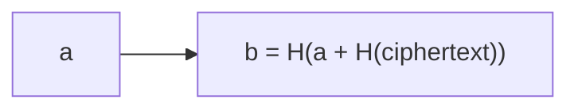
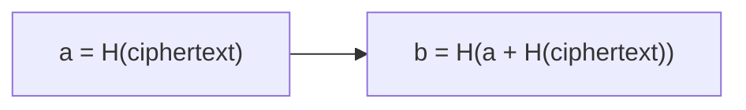
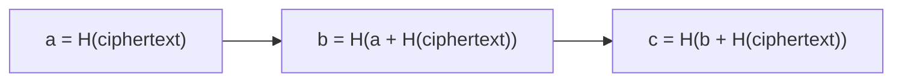
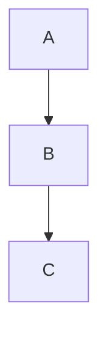
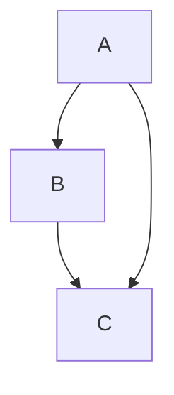
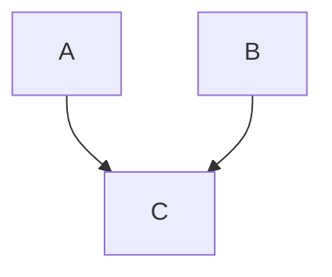

# Protocol Prototypes

## Non-overlapping Snapshots

In this version clients would be allowed to create snapshots and updates that are related to a snapshot. There is only one snapshot allowed at the time, meaning the current state of a document would be constructed out of one snapshot and all their updates.

Open questions:

- Can snapshots be connected and verified without downloading all of them?
- Does the one snapshot rule cause a lot of complexity?

### Brainstorming

#### Verifying the Snapshots

With every snapshot a hash can be created that contains the hash of the previous snapshot and the hash of the current snapshot's ciphertext. This way a client can verify that the current snapshot is based on the previous one.



An exception is the first snapshot which only contains the hash of the ciphertext.



A longer chain then looks like this:



This allows clients that store the last known hash to verify that the current snapshot is based on the one the client is has seen before.

To do so the client would need to receive the hashes of snapshots and their ciphertexts. With that information the client be able to recreate the hash of the second-last snapshot and then can verify the current snapshot based on the second-last and a hash of the current snapshot's ciphertext.

The updates don't have to be included in this hash since a client just wants to confirm that the server doesn't send old snapshots.

The server has to store the entire hash-chain and the most recent snapshot.
When a client asks the server for the latest snapshot and provide a hash the server will only return the hash-chain up until the point where the provided hash matches.

The hashes are ideally stored encrypted in a local database. This way clients can make sure the service only sends already known or newer snapshots of a document.
It's important to store the hashes encrypted since they expose possibly sensible meta-data on which snapshot a client already received.

#### Complexity of restricting to a single chain

On one hand enforcing a chain means that clients might need to handle rejections from the server to create a new snapshot. That said clients must handle this case anyway since things can go wrong on the network or while persisting a new snapshot. Therefor this is an acceptable solution.

On the other hand complexity in terms of retrieving the current state is way simpler in a chain compared to a DAG.

## Overlapping Snapshots

In this version clients would be allowed to create snapshots and updates that are related to a snapshot. Snapshots can be overlapping, meaning the current state of a document would be constructed out of multiple snapshots and all their updates.

Open questions:

- Can snapshots be connected and verified without downloading all of them?
- How does this impact privacy e.g. visibility of previous changes for new collaborators?
- How is the performance loading of a document compared to the other versions?

### Brainstorming

A Snapshot can reference previous Snapshots with a hash created out of the hashes of the previous snapshots and the current one.

```json
{
  "hash": "...", // hash of the ciphertext + canonicalized parents hashes
  "parents": ["..."],
  "updates": {
    "signingPublicKeyX": "clockX",
    "signingPublicKeyY": "clockY"
  }
}
```

This results in a DAG.

Example situations of snapshot references that can happen:








This means while the snapshots can created in parallel and can fan out, it's possible and desired to return to a single snapshot.
The benefit is that snapshots don't need to be blocking. This means that I can sync to multiple servers and don't need to rely on a central service.

This results in the following properties:

- A Service can determine if a snapshot is recent and includes all other snapshots and updates.
- If not it can identify all snapshots including all updates related to the snapshots as well as updates not included in the snapshots.

#### When to discard part of the DAG

In case of a single service coordinating the changes we have a fixed list of participants at a given time.

#### Concerns

Resolving data might be really tricky if a snapshot doesn't include all the latest updates.
In addition you can't send an update that was commited before the snapshot to a new client in case the key was rotated with the snapshot.

Clients must handle snapshot creation failure anyway, so why not simplify and create a chain.

If a device was removed or added the server can simply prevent users from sending updates and require a new snapshot.
Then one users wins creating a snapshot. It's all not a problem since CRDTs won't result in collisions.

## Events only

In this version clients only can create updates. This version has the benefit of its verifiability to the beginning.

- How does this impact privacy e.g. visibility of previous changes for new collaborators?
- How is the performance loading of a document compared to the other versions?
